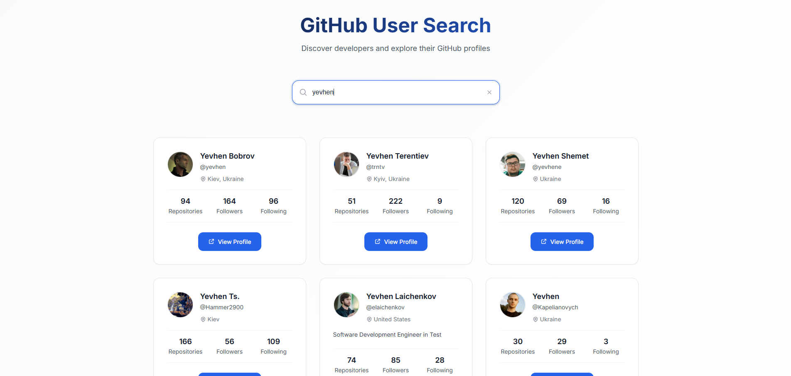

# GitHub User Search

A modern React TypeScript application for searching GitHub users and repositories. This project demonstrates proficiency in **Git-based workflows**, **CI/CD implementation**, and **modern web development practices**.

## 🎯 Project Purpose

This application serves multiple purposes:
- **Portfolio demonstration** of full-stack development skills
- **Git workflow mastery** showcase (GitFlow, branching strategies, PR workflows)
- **CI/CD pipeline implementation** with automated testing and deployment
- **Modern React ecosystem** proficiency with TypeScript, Vite, and testing

## 🎨 Preview



## 🚀 Features

- **Real-time GitHub user search** with debounced input
- **User profile display** with avatar, bio, and statistics
- **Repository listing** with sorting and filtering
- **Responsive design** optimized for all devices
- **Error handling** with user-friendly messages
- **Loading states** and smooth transitions

## 🛠 Technology Stack

### Frontend
- **React 19** with TypeScript
- **Vite** for fast development and building
- **CSS Modules** for component-scoped styling
- **GitHub REST API** integration

### Development Tools
- **ESLint + Prettier** for code quality
- **Vitest** for unit testing
- **@testing-library/react** for component testing
- **jsdom** for DOM simulation in tests

### DevOps & Workflow
- **Git Flow** branching strategy (`master` → `develop` → `feature/*`)
- **GitHub Actions** for CI/CD pipeline
- **Automated testing** on pull requests
- **Environment-based deployments**

## 📋 Prerequisites

- Node.js 18+ and npm
- Git for version control
- GitHub account for API access

## ⚙️ Installation & Setup

1. **Clone the repository**
   ```bash
   git clone https://github.com/Yevhenbk/github-user-search.git
   cd github-user-search
   ```

2. **Install dependencies**
   ```bash
   npm install
   ```

3. **Environment configuration**
   ```bash
   # Copy and configure environment variables
   cp .env.example .env
   ```
   
   Add your GitHub Personal Access Token to `.env`:
   ```env
   VITE_GITHUB_API_BASE_URL=https://api.github.com
   VITE_GITHUB_TOKEN=your_github_token_here
   ```

4. **Start development server**
   ```bash
   npm run dev
   ```

## 🧪 Testing

Comprehensive test suite with multiple testing strategies:

```bash
# Run tests in watch mode
npm run test

# Run tests once
npm run test:run

# Run tests with UI (if @vitest/ui installed)
npm run test:ui
```

**Testing Coverage:**
- Component rendering tests
- User interaction simulation
- API integration tests
- Error boundary testing

## 🔄 Git Workflow & CI/CD

### Branching Strategy
This project implements **GitFlow methodology**:

```
master (production)
└── develop (integration)
    ├── feature/search-functionality
    ├── feature/user-profile-display
    └── feature/repository-listing
```

### Development Workflow
1. **Feature Development**: `git checkout -b feature/feature-name develop`
2. **Development**: Code, test, commit with conventional commits
3. **Integration**: Create PR from `feature/*` → `develop`
4. **Testing**: Automated CI pipeline runs tests
5. **Release**: Merge `develop` → `master` for production

### CI/CD Pipeline Features
- **Automated Testing** on every PR
- **Code Quality Checks** (ESLint, TypeScript)
- **Build Verification** for production readiness
- **Environment Deployments** (staging/production)
- **Dependency Security Scanning**

## 📚 API Integration

### GitHub REST API
- **Search Users**: `/search/users`
- **User Details**: `/users/{username}`
- **User Repositories**: `/users/{username}/repos`

### Rate Limiting
- **Unauthenticated**: 60 requests/hour
- **Authenticated**: 5,000 requests/hour (with token)

## 🏗 Project Structure

```
src/
├── components/           # Reusable UI components
├── pages/               # Route-level components
├── api/                 # GitHub API integration
├── hooks/               # Custom React hooks
├── utils/               # Helper functions
├── types/               # TypeScript definitions
├── __tests__/           # Test files
└── assets/              # Static resources
```

## 🔧 Available Scripts

| Command | Description |
|---------|-------------|
| `npm run dev` | Start development server |
| `npm run build` | Build for production |
| `npm run preview` | Preview production build |
| `npm run test` | Run tests in watch mode |
| `npm run test:run` | Run tests once |
| `npm run lint` | Lint code with ESLint |

## 🎨 Code Quality & Standards

- **TypeScript** for type safety
- **ESLint + Prettier** for consistent formatting
- **Conventional Commits** for clear commit history
- **Component-driven development** with reusable components
- **Test-driven development** with comprehensive coverage

## 🔐 Environment Variables

| Variable | Description | Required |
|----------|-------------|----------|
| `VITE_GITHUB_API_BASE_URL` | GitHub API base URL | Yes |
| `VITE_GITHUB_TOKEN` | GitHub Personal Access Token | Optional* |

*Token is optional but recommended for higher rate limits

## 📈 Performance Optimizations

- **Code splitting** with React.lazy()
- **Debounced search** to reduce API calls
- **Memoized components** for optimal re-renders
- **Vite's fast HMR** for development efficiency

## 🚀 Deployment

The application supports multiple deployment strategies:
- **GitHub Pages** (static hosting)
- **Netlify/Vercel** (JAMstack platforms)
- **Docker containers** for containerized deployment

## 🤝 Contributing

1. Fork the repository
2. Create feature branch: `git checkout -b feature/amazing-feature develop`
3. Commit changes: `git commit -m 'feat: add amazing feature'`
4. Push to branch: `git push origin feature/amazing-feature`
5. Open Pull Request to `develop` branch

## 📄 License

This project is licensed under the MIT License - see the [LICENSE](LICENSE) file for details.

## 👨‍💻 Author

**Yevhen** - [GitHub Profile](https://github.com/Yevhenbk)

---

*This project demonstrates proficiency in modern web development, Git workflows, CI/CD practices, and test-driven development methodologies.*
